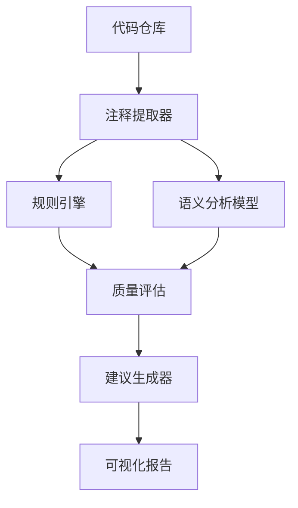

## 代码注释质量分析系统
### 系统架构设计

### 核心组件说明
#### 注释提取器
- 功能：从代码仓库中提取出所有的注释。
- 实现：使用正则表达式或AST解析器来提取注释。
- 输入：代码仓库。
- 输出：结构化JSON

#### 注释质量评估引擎
- 功能：对提取出的注释进行质量评估。
- 实现：使用大模型和规则引擎来评估注释的质量。
- 输入：结构化JSON。

#### 语义分析模型
- 相关性检测：Sentence-BERT模型（all-MiniLM-L6-v2）
- 代码理解：CodeBERT模型
- 相似度计算：余弦相似度算法

#### 建议生成器
- 功能：根据评估结果生成改进建议。
- 实现：使用大模型和规则引擎来生成改进建议。
- 输入：评估结果。
- 输出：改进建议。

### 工程化实现方案
- 语言：Python 3.10
- 大模型：OpenAI 或者 ollama

### 输出报告示例

**析报告：tensorflow/tensorflow**
**问题注释示例**
| 文件位置 | 原始注释 | 问题类型 | 建议 |
|---------|---------|---------|------|
| core/ops/math_ops.py | "do math" | 过于简略 | 建议说明具体数学运算类型 |
| python/keras/layers/core.py | "process inputs" | 重复出现(5次) | 建议统一合并到模块文档字符串 |

**统计概览**
- 低质量注释占比: 12.7%
- 平均注释质量分: 68/100
- 主要问题分布:
  • 重复注释 (43%)
  • 内容模糊 (32%)
  • 过期注释 (25%)

